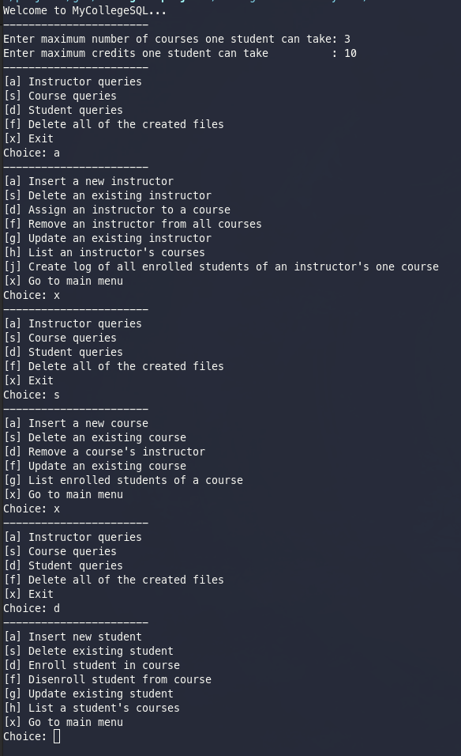

# College Database System
My second year semester project for Structured Programming course.

06.01.2021
## Project Description
In this project you should implement a course registration application using file operations. Your project should use relational database logic.

## Project Details
* In the registration system students can apply to courses, remove applications and update applications.
* Courses file should contain unique course id, name, credit, quota and the course's instructor id. Each lesson is taught by only one instructor.
* Instructors file should contain unique instructor id, name, surname and title of the instructor.
* Students file should contain unique student id, name, surname, total registered course count and total registered credit count.
* A student can take one or more courses. Student and course has many to many relation. This many to many table sshould also contain an auto generated unique id, current registration status (registered, not_registered) and registration date.
* System administrator should enter a maximum course registration limit and maximum credit registration limit. System should block any attempt that exceeds these limits.

## Screenshots
* Menu

