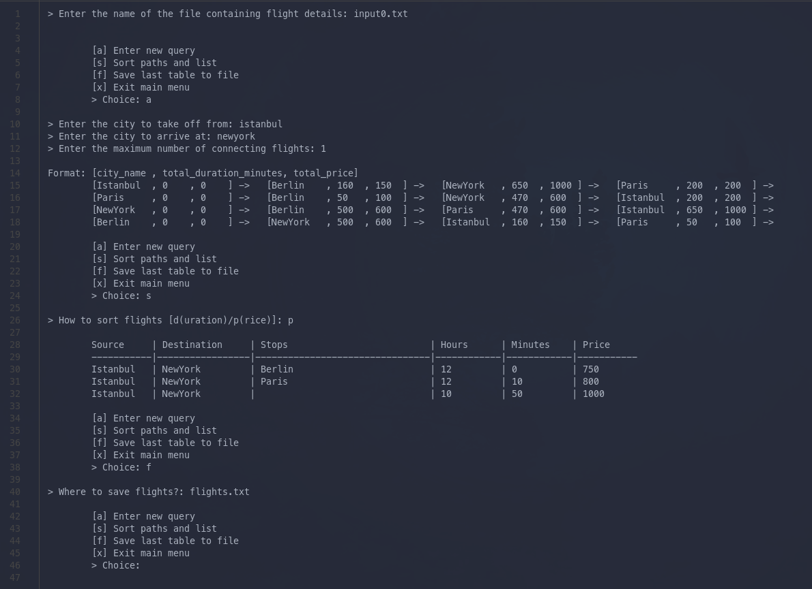

# Flight Paths
My third year semester project for Algorithm Analysis course.

26.12.2021
## Project Description
A flight ticket retailer firm needs an algorithm that calculates shortest or cheapest route between source and destination airports. Input file contains in each row source, destination, flight hours, flight minutes and price. When a user enters source and destination airports, maximum number of connecting flights and also the sorting criteria (duration or price), the program should display all routes sorted by entered criteria.

## Project Details
* sample.txt contains the sample input format.
* The Program should first create a graph using input file.
* The user should be able to make repeated queries unless he/she closes the program. The program should save the query results to a file.
* The program should inform the user when no paths are available.
* Each connecting flight adds 1 hour to the total flight duration.

## Screenshots
* Usage

