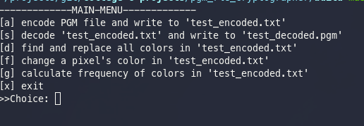

# PGM Run Length Encoding Cryptographer
My second year semester project for Data Structures course.

13.06.2021
## Project Description
You should write a program that encrypts and decrypts PGM-P2 files using RLE method.

## Project Details
If an image contains parts of repeated colors, one can save space by encoding this image using RLE. In RLE, color codes are preceded by repeat counts. For instance, 5 5 5 5 5 5 5 5 5 5 becomes 10 5. Assuming one pixel is 1 byte, 10 bytes of information is stored using 2 bytes.

Read more:
1. [PGM format](http://netpbm.sourceforge.net/doc/pgm.html)
2. [More PGM samples](https://people.sc.fsu.edu/~jburkardt/data/pgma/pgma.html)

## Screenshots
* Menu

