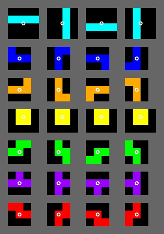
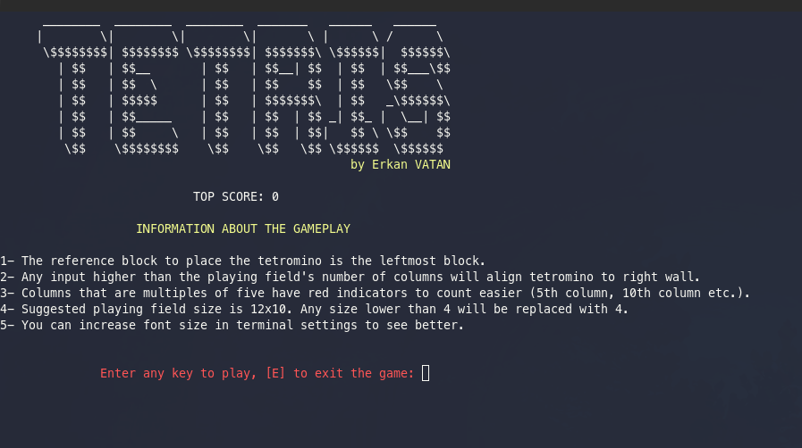
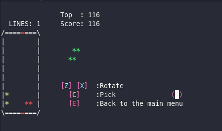

# Simple Tetris
My first year semester project for Introduction to Computer Science course.

30.12.2019

## Project Description
Design a program, which a user could play the "TETRIS" game.

## Project Details
* Your program should ask the size of the game board.
* Your program should create different pieces randomly at each round.
* Available pieces are:

* Your program should rotate the given piece if the user demands.
* The user would give the x coordinates for placing the leftmost corner of the
given puzzle piece.
* The program would place the given puzzle piece to the available most bottom part
of the game board.
* If any horizontal line is full with puzzle pieces, your program should break the line
and let all the pieces placed in the upper line fall down until a piece occurs.
* Your program should also calculate the points obtained from the aforementioned
lines.
* Your program also should save the highest score.
* The program should end if the upperline of the game board consists of any puzzle
pieces.
* The user could terminate the game, whenever he/she wants.

## Screenshots
* Menu

* In game

